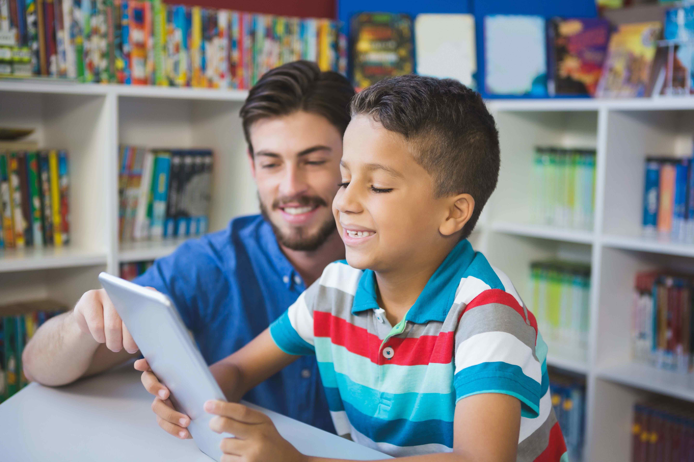

Homeschooling is a type of education where children are taught in the comfort of their homes by either their parents or an appointed professional tutor.

Reasons for choosing homeschooling differ from parent to parent and that includes reasons such as schools not catering for children with disabilities, poor quality education, poor curriculum, bullying, racism, religious and cultural beliefs and more other reasons.

That being said, lately due to the Corona Virus (COVID-19) pandemic, South African parents were forced to homeschool because of the nationwide lockdown and for some parents, it occurred to them that this is a lifestyle they could adopt. Should you also seek to homeschool fulltime, here are three brands you could consider to help you with homeschooling resources:

**Impaq**

Impaq has been around since 2012 and they have been providing home education resources ever since. They provide education products aligned with the CAPS curriculum in both Afrikaans and English from Grade R – 12.

**Brainline**

This company was started 30 years ago and they also provide education resources from Grade R – 12. Furthermore, they provide assessments aligned with the Independent Examination Board (IEB) for those homeschoolers who may be interested in that route.

**Think Digital College**

This is a virtual school that provides both the South African and British International aligned curricula. They provide a 14-day free trial which helps you try it out and decide if it’s the best option for your children.

We would like to wish you all the best with your homeschooling journey and hope that it works out for you and your kids.

Happy homeschooling!