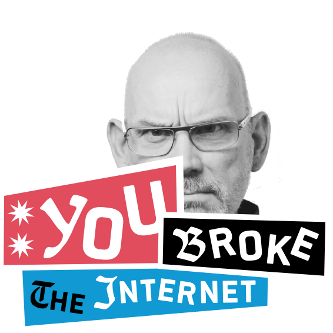

> So this is my first fake blog post

### Etymology

Early use of the phrase (circa the mid-1990s) refers to literally breaking the [Internet](https://en.wiktionary.org/wiki/Internet "Internet") connection of a single device. It also refers to breaking the [World Wide Web](https://en.wiktionary.org/wiki/World_Wide_Web "World Wide Web") or the Internet itself, with the implication that it would be impossible or implausible to do so in most ordinary contexts.

A figurative usage of the phrase emerged in the early 2000s. Rather than the Internet or an Internet connection literally breaking, the figurative meaning describes a [web server](https://en.wikipedia.org/wiki/web_server "w:web server") becoming overwhelmed by a surge in organic, non-malicious web traffic. It can also describe a deliberate, malicious attempt to overwhelm a web server, as in a [denial-of-service attack](https://en.wikipedia.org/wiki/Denial-of-service_attack "w:Denial-of-service attack") or other [cyberattack](https://en.wikipedia.org/wiki/cyberattack "w:cyberattack").

In the early 2010s, "break the internet" developed a secondary figurative usage in [Internet slang](https://en.wikipedia.org/wiki/Internet_slang "w:Internet slang"). Similar to "[going viral](https://en.wiktionary.org/wiki/go_viral "go viral")", the slang usage refers to behavior that causes a dramatic increase in web traffic or [social media](https://en.wikipedia.org/wiki/social_media "w:social media") commentary, especially when the behavior was [ostentatious](https://en.wiktionary.org/wiki/ostentatious "ostentatious") or [controversial](https://en.wiktionary.org/wiki/controversial "controversial"). The phrase was famously used on the November 2014 issue of *[Paper](https://en.wikipedia.org/wiki/Paper_(magazine) "w:Paper (magazine)")* magazine, titled "Break the Internet" and featuring American celebrity [Kim Kardashian](https://en.wikipedia.org/wiki/Kim_Kardashian "w:Kim Kardashian") on the cover. The magazine was not the first to use the phrase in this sense, but it did popularize it.

