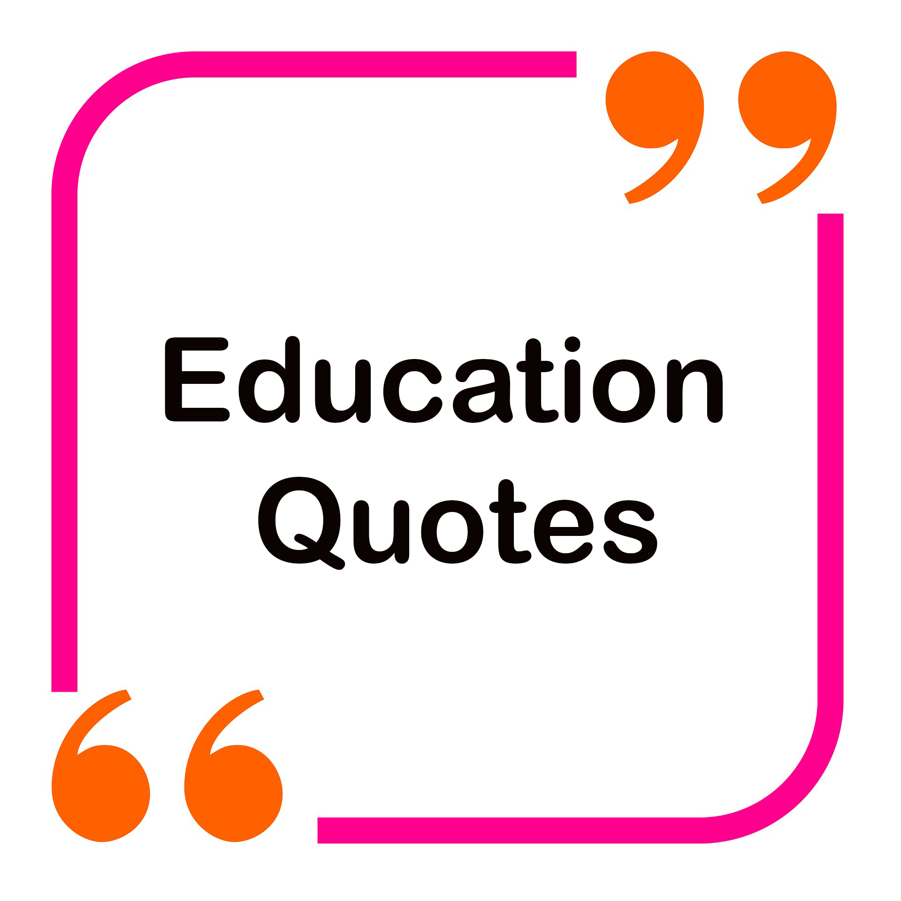

1. “Education is the most powerful weapon which you can use to change the world.” ― Nelson Mandela

2. “A good head and good heart are always a formidable combination. But when you add to that a literate tongue or pen, then you have something very special.” ― Nelson Mandela

3. “The function of education is to teach one to think intensively and to think critically. Intelligence plus character – that is the goal of true education.” – Martin Luther King, Jr.

4. “You educate a man; you educate a man. You educate a woman; you educate a generation.” ― Brigham Young

5. “My mother said I must always be intolerant of ignorance but understanding of illiteracy. That some people, unable to go to school, were more educated and more intelligent than college professors.” – Maya Angelou

6. “Children must be taught how to think, not what to think.” ― Margaret Mead

7. “Do not train a child to learn by force or harshness; but direct them to it by what amuses their minds, so that you may be better able to discover with accuracy the peculiar bent of the genius of each.” ― Plato

8. “Education is our passport to the future, for tomorrow belongs to the people who prepare for it today.” ― Malcolm X

9. “In learning you will teach, and in teaching you will learn.” ― Phil Collins

10. “Wisdom is not a product of schooling but of the lifelong attempt to acquire it.” ― Albert Einstein